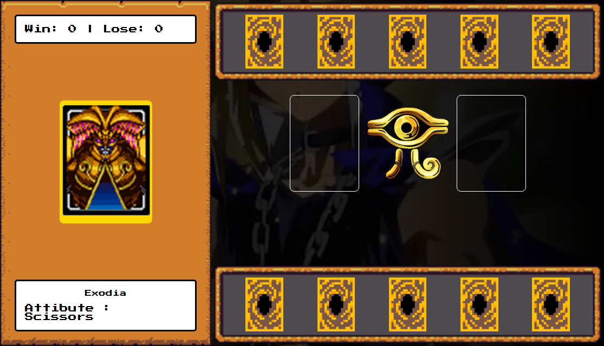

# 🎴 Yu-Gi-Oh! Jokenpo

Bem-vindo ao **Yu-Gi-Oh! Jokenpo**, um jogo interativo que combina o clássico Jokenpo com a temática épica de Yu-Gi-Oh! Desafie a máquina e veja quem é o verdadeiro mestre dos duelos! 💥

## 📸 Screenshot do Jogo

## 🚀 Funcionalidades
- Escolha sua carta e entre no duelo!
- Adversário com escolha aleatória para um jogo justo.
- Lógica de vitória baseada nas regras clássicas do Jokenpo.
- Interface temática e interativa com visuais inspirados no universo Yu-Gi-Oh!

## 🛠️ Tecnologias Utilizadas
- **HTML5**: Para estrutura da página.
- **CSS3**: Para estilização e animações.
- **JavaScript**: Para lógica do jogo e interatividade.

## 📚 Como Jogar
1. Faça sua escolha clicando na carta desejada.
2. O oponente fará sua jogada automaticamente.
3. Veja quem venceu no painel de resultados.
4. Divirta-se e tente vencer a máquina! 🏆

## 🎓 Créditos
Este projeto foi desenvolvido como parte de um desafio educacional da **Digital Innovation One**.

---

🌟 Não esqueça de dar uma ⭐ no repositório se gostou do projeto!

